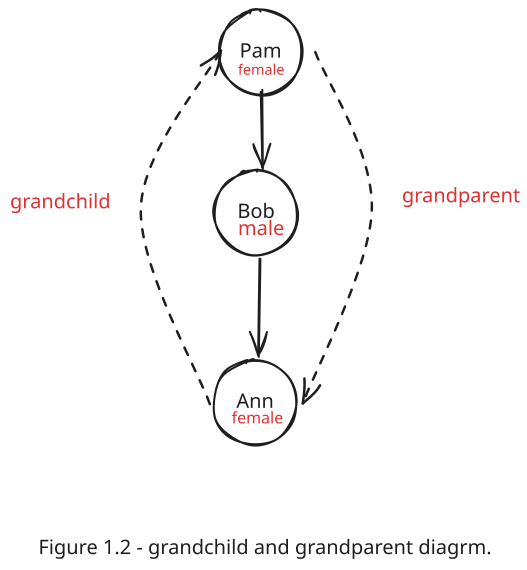
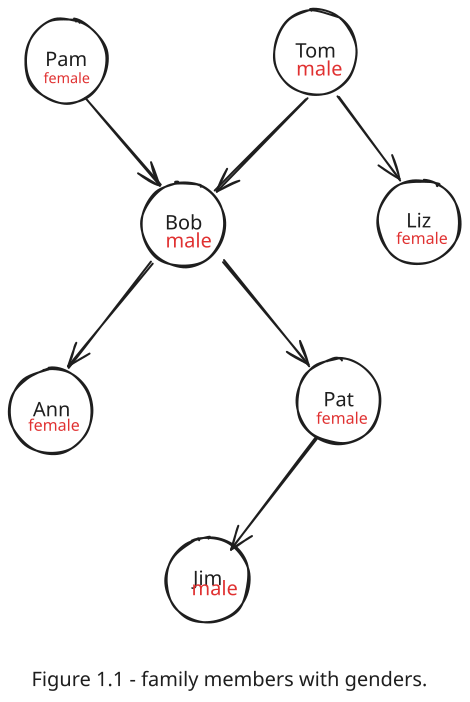

# Chapter 1: Introduction to Prolog

This chapter introduces the fundamental concepts of Prolog, a language for symbolic and non-numeric computation. We will explore how to define relationships using facts and rules.

**Associated Lab File:** [labs/lab01/lab01.pl](../labs/lab01/lab01.pl)

---

## Key Concepts

### 1. Defining Relations with Facts

In Prolog, we can define relationships between objects as **facts**. For example, to state that Tom is a parent of Bob, we write:

```prolog
parent(tom, bob).
```

This establishes a `parent` relationship. We can then query the Prolog system to get information about this relationship.

#### Asking Questions (Queries)

- **Is Bob a parent of Pat?**

  ```prolog
  ?- parent(bob, pat).
  ```

- **Who is Liz's parent?**

  ```prolog
  ?- parent(X, liz).
  ```

- **Who are Bob's children?**

  ```prolog
  ?- parent(bob, X).
  ```

Prolog answers these questions by trying to satisfy the **goals** provided.

### 2. Complex Queries

We can ask more complex questions by combining goals.

- **Who is a grandparent of Jim?**
  This requires finding a person `Y` who is a parent of Jim, and then finding a person `X` who is a parent of `Y`.

  

  ```prolog
  ?- parent(Y, jim), parent(X, Y).
  ```

- **Do Ann and Pat have a common parent?**

  ```prolog
  ?- parent(X, ann), parent(X, pat).
  ```

### 3. Defining Relations with Rules

We can also define new relationships using **rules**. A rule is a general statement about objects and their relationships.

For example, we can define a `mother` relation based on the existing `parent` and `female` relations.

**Logical Statement:**
For all X and Y, X is the mother of Y if X is a parent of Y and X is female.

**Prolog Rule:**

```prolog
mother(X, Y) :-
    parent(X, Y),
    female(X).
```

The `:-` symbol is read as "if".

### 4. Important Terminology

- **Clause:** A Prolog program consists of clauses. Each clause terminates with a full stop (`.`).
- **Atom:** A constant value, like `tom` or `ann`.
- **Variable:** A general object, like `X` or `Y`. Variable names start with an uppercase letter or an underscore.
- **Unary Relation:** A property of a single object (e.g., `female(pam)`).
- **Binary Relation:** A relationship between two objects (e.g., `parent(tom, bob)`).

### 5. Family Tree Example

Below is the full family tree from `lab01.pl` which we will be using.



```prolog
% Defining the parent relation
parent(tom, bob).
parent(tom, liz).
parent(pam, bob).
parent(bob, ann).
parent(bob, pat).
parent(pat, jim).

% Adding info about the gender of each person
female(pam).
female(liz).
female(pat).
female(ann).

male(tom).
male(bob).
male(jim).

% Defining the mother relation using a rule
mother(X,Y) :-
    parent(X,Y),
    female(X).

% Defining the grandparent relation
grandparent(X,Z) :-
    parent(X,Y),
    parent(Y,Z).

% Defining the sister relation
sister(Y,Z) :-
    parent(X,Y),
    parent(X, Z),
    female(Y),
    Y \= Z.
```
