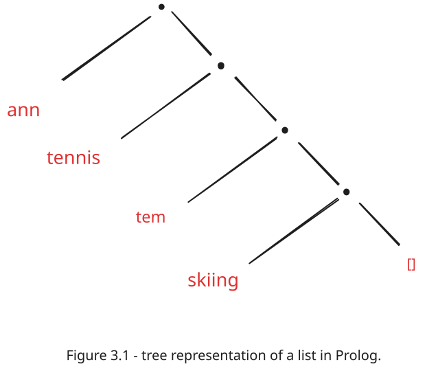
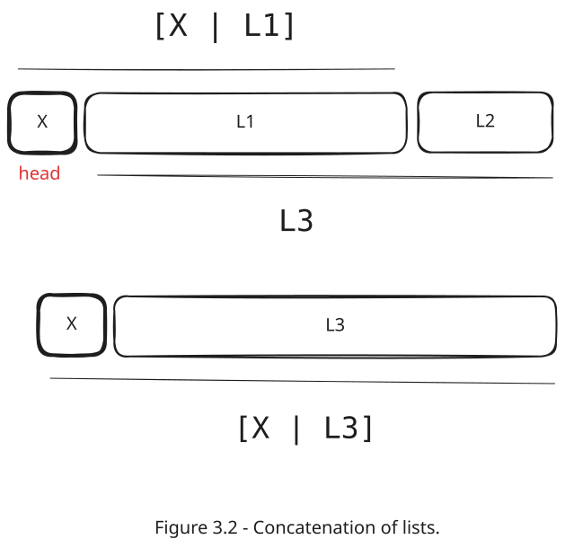

# Chapter 3: Lists, Operators, and Arithmetic

This chapter covers the representation of lists in Prolog, along with common operations such as concatenation, membership testing, and adding/deleting elements. The concepts are accompanied by examples and code snippets from the lab file:

- **Lab File:** [`labs/lab03/lab03.pl`](../labs/lab03/lab03.pl)

---

## 3.1 Representation of Lists

A **list** is a sequence of any number of items. In Prolog, a list is written with square brackets, and its elements are separated by commas.

```prolog
[ann, tennis, torn, skiing]
```

All structured objects in Prolog are trees, and lists are no exception. A list is either empty or consists of a **head** (the first element) and a **tail** (the rest of the list).



> The elements of a list can be objects of any kind, including other lists.

We can separate the head from the tail using the `|` symbol.

```prolog
L = [a, b, c]
Tail = [b, c]
L = [a | Tail]
```

The `|` notation is flexible and allows for various ways to represent a list:

```prolog
[a,b,c] = [a | [b,c]] = [a,b | [c]] = [a,b,c | []]
```

To summarize:

- A list is either empty or consists of a head and a tail.
- The tail of a list must also be a list.
- Lists are a special case of binary trees, but Prolog provides a more readable notation.

---

## 3.2 Operations on Lists

### 3.2.1 Membership

The `member/2` predicate checks if an item is present in a list. It can be used in several ways:

**1. Checking for Membership**

```prolog
?- member(b, [a, b, c]).
yes
```

**2. Generating Members**
You can generate all members of a list through backtracking:

```prolog
?- member(X, [a, b, c]).
X = a ;
X = b ;
X = c ;
no
```

**3. Finding Lists with a Given Member**
You can also find lists that contain a specific item:

```prolog
?- member(apple, L).
L = [apple | _A] ;
L = [_A, apple | _B] ;
L = [_A, _B, apple | _C] ;
...
```

**4. Generating Permutations**
By fixing the length of the list, you can generate permutations of its elements:

```prolog
?- L = [_, _, _], member(a, L), member(b, L), member(c, L).
L = [a, b, c] ;
L = [a, c, b] ;
...
```

**5. Practical Example: Word-for-Word Translation**
The `member/2` predicate can be used for simple translations. The following example translates between English and Spanish using a small dictionary.

- **Code:** See [`labs/lab03/lab03.pl`](../labs/lab03/lab03.pl) for the implementation.

```prolog
?- Dict = [p(one, uno), p(two, dos), p(three, tres)],
   member(p(two, Sp), Dict),
   member(p(En, tres), Dict).
Sp = dos,
En = three
```

### 3.2.2 Concatenation

The `conc/3` relation concatenates two lists.

```prolog
conc(L1, L2, L3)
```

**Definition:**

1. If the first list is empty, the concatenation of `[]` and `L` is `L`.

   ```prolog
   conc([], L, L).
   ```

2. If the first list is non-empty `[X | L1]`, then its concatenation with `L2` is `[X | L3]`, where `L3` is the concatenation of `L1` and `L2`.

   ```prolog
   conc([X | L1], L2, [X | L3]) :-
       conc(L1, L2, L3).
   ```



**Usage:**

- **Concatenating Lists:**

  ```prolog
  ?- conc([a, b, c], [1, 2, 3], L).
  L = [a, b, c, 1, 2, 3]
  ```

- **Decomposing Lists:**

  ```prolog
  ?- conc(L1, L2, [a, b, c]).
  L1 = [], L2 = [a, b, c] ;
  L1 = [a], L2 = [b, c] ;
  ...
  ```

- **Finding Patterns:**

  ```prolog
  ?- conc(Before, [may | After], [jan, feb, mar, apr, may, jun, jul, aug, sep, oct, nov, dec]).
  Before = [jan, feb, mar, apr],
  After = [jun, jul, aug, sep, oct, nov, dec]
  ```

### 3.2.3 Adding and Deleting Items

**Adding an Item**
The easiest way to add an item to a list is to place it at the front, making it the new head.

```prolog
add(X, L, [X | L]).
```

**Deleting an Item**
The `del/3` relation deletes an item from a list.

```prolog
del(X, L, L1)
```

**Definition:**

1. If the item `X` is the head of the list, the result is the tail.

   ```prolog
   del(X, [X | Tail], Tail).
   ```

2. If `X` is in the tail, it is deleted from there.

   ```prolog
   del(X, [Y | Tail], [Y | Tail1]) :-
       del(X, Tail, Tail1).
   ```

`del/3` is non-deterministic and will delete each occurrence of the item through backtracking.

- **Deleting Items:**

  ```prolog
  ?- del(a, [a, b, a, a], L).
  L = [b, a, a] ;
  L = [a, b, a] ;
  L = [a, b, a] ;
  no
  ```

- **Inserting Items:**
  `del/3` can also be used to insert an item into a list.

  ```prolog
  ?- del(a, L, [1, 2, 3]).
  L = [a, 1, 2, 3] ;
  L = [1, a, 2, 3] ;
  ...
  ```

### 3.2.5 Sublist

The `sublist/2` relation checks if a list `S` occurs within a list `L` as its sublist.

**Example:**

- `sublist([c,d,e], [a,b,c,d,e,f])` is true.
- `sublist([c,e], [a,b,c,d,e,f])` is not.

**Definition:**

`S` is a sublist of `L` if:

1. `L` can be decomposed into two lists, `L1` and `L2` (where `L2` is the remainder after `L1`).
2. `L2` can be further decomposed into `S` and some `L3` (where `S` is the leading part of `L2`).

This can be expressed in Prolog using `conc/3`:

```prolog
sublist(S, L) :-
    conc(L1, L2, L),
    conc(S, L3, L2).
```

The `sublist` predicate can also be used to find all sublists of a given list:

```prolog
?- sublist(S, [a,b,c]).
S = [] ;
S = [a] ;
S = [a,b] ;
S = [a,b,c] ;
S = [] ;
S = [b] ;
S = [b,c] ;
S = [] ;
S = [c] ;
no
```

---

## 3.3 Operator Notation

In mathematics, we use infix operators like `2*a + b*c`. In Prolog, this is equivalent to the standard form `+(*(2, a), *(b, c))`. Operators are merely a **notational extension** to improve readability.

### 3.3.1 Defining Operators

A programmer can define their own operators using the `op` directive:

```prolog
:- op(Precedence, Type, Name).
```

- **Precedence:** An integer (usually 1 to 1200). Lower precedence values bind stronger (e.g., `*` has lower precedence than `+`).
- **Type:** Defines the position and associativity:
    - **Infix:** `xfx` (non-associative), `xfy` (right-associative), `yfx` (left-associative).
    - **Prefix:** `fx`, `fy`.
    - **Postfix:** `xf`, `yf`.

**Example:**
```prolog
:- op(600, xfx, has).
peter has information. % Equivalent to: has(peter, information).
```

### 3.3.2 Precedence and Associativity

- **'x'** represents an argument whose precedence must be **strictly lower** than the operator's.
- **'y'** represents an argument whose precedence is **lower or equal** to the operator's.

This rules help disambiguate expressions like `a - b - c`. If `-` is `yfx`, it is interpreted as `(a - b) - c`.

---

## 3.4 Arithmetic

Prolog provides predefined operators for basic arithmetic, but they are not automatically evaluated.

| Operator | Operation |
| :--- | :--- |
| `+` | Addition |
| `-` | Subtraction |
| `*` | Multiplication |
| `/` | Real Division |
| `//` | Integer Division |
| `mod` | Modulo (Remainder) |
| `**` | Power |

### 3.4.1 The `is` Operator

To force the evaluation of an arithmetic expression, use the `is` operator:

```prolog
?- X is 1 + 2.
X = 3.
```

The right side must be an expression where all variables are already instantiated to numbers.

### 3.4.2 Comparison Operators

Comparison operators also force evaluation of both sides:

- `X > Y`: Greater than
- `X < Y`: Less than
- `X >= Y`: Greater or equal
- `X =< Y`: Less or equal
- `X =:= Y`: Values are equal
- `X =\= Y`: Values are not equal

> **Note:** `=` matches structures (unification), while `=:=` compares numerical values.

### 3.4.3 Examples

**1. Greatest Common Divisor (GCD)**

```prolog
gcd(X, X, X).
gcd(X, Y, D) :- X < Y, Y1 is Y - X, gcd(X, Y1, D).
gcd(X, Y, D) :- Y < X, gcd(Y, X, D).
```

**2. Counting Elements in a List**

```prolog
length([], 0).
length([_ | Tail], N) :-
    length(Tail, N1),
    N is 1 + N1.
```

---

## Summary

- **Operators** are functors that provide a more readable notation.
- **Precedence** determines the principal functor (higher value = principal functor).
- **Arithmetic** must be explicitly invoked using `is` or comparison operators.
- All variables in an arithmetic expression must be instantiated before evaluation.
