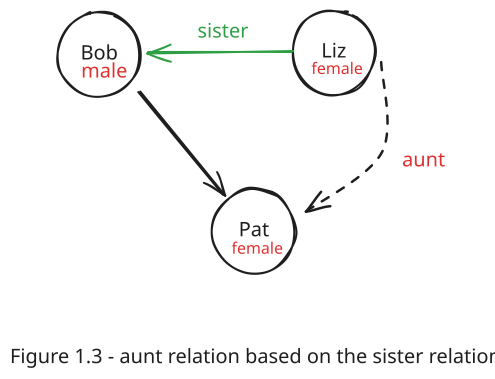

# Chapter 1: Exercises

This section provides exercises to practice the concepts introduced in Chapter 1. The solutions can be found in the associated lab file.

**Solutions File:** [labs/lab01/ex01.pl](../labs/lab01/ex01.pl)

---

## Exercises

### Exercise 1.1

Assuming the `parent` relation defined in `lab01.pl`, what will be Prolog's answers to the following questions?

a) `?- parent(jim, X).`
b) `?- parent(X, jim).`
c) `?- parent(pam, X), parent(X, pat).`
d) `?- parent(pam, X), parent(X, Y), parent(Y, jim).`

---

### Exercise 1.2

Translate the following statements into Prolog rules:

a) Everybody who has a child is happy.

- **Hint:** Introduce a one-argument relation `happy/1`.

b) For all X, if X has a child who has a sister, then X has two children.

- **Hint:** This implies that if there's a child `Y` of `X`, and `Y` has a sister, then `X` must have at least two children.

---

### Exercise 1.3

Define the relation `grandchild(Grandchild, Grandparent)` using the `parent/2` relation.

- **Hint:** This will be the inverse of the `grandparent` relation.

---

### Exercise 1.4

Define the relation `aunt(Aunt, NieceOrNephew)` in terms of the `parent/2` and `sister/2` relations.

- **Hint:** An aunt is the sister of one's parent.
- **Diagram:**

  
