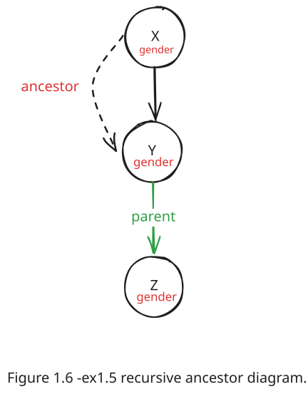

# Chapter 1: Exercises

These exercises are based on "Prolog Programming for Artificial Intelligence" by Ivan Bratko, fourth edition.

**Solutions File:** [labs/lab01/ex01.pl](../labs/lab01/ex01.pl)

---

## Exercise 1.1

Assuming the `parent` relation defined in `lab01.pl`, what will be Prolog's answers to the following questions?

a) `?- parent(jim, X).`
b) `?- parent(X, jim).`
c) `?- parent(pam, X), parent(X, pat).`
d) `?- parent(pam, X), parent(X, Y), parent(Y, jim).`

---

## Exercise 1.2

Formulate in Prolog the following questions about the parent relation:

a) Who is Pat's parent?
b) Does Liz have a child?
c) Who is Pat's grandparent?

---

## Exercise 1.3

Translate the following statements into Prolog rules:

a) Everybody who has a child is happy.

- **Hint:** Introduce a one-argument relation `happy/1`.

b) For all X, if X has a child who has a sister, then X has two children.

- **Hint:** Introduce a new relation `hastwochildren/1`.

---

### Exercise 1.4

Define the relation `grandchild(Grandchild, Grandparent)` using the `parent/2` relation.

---

### Exercise 1.5

Define the relation `aunt(Aunt, NieceOrNephew)` in terms of the `parent/2` and `sister/2` relations.

- **Hint:** An aunt is the sister of one's parent. You can use the `sister/2` relation from `lab01.pl`.

  

---

### Exercise 1.6

Consider the following alternative definition of the ancestor relation:

```prolog
ancestor( X, Z) :-
  parent( X, Z).

ancestor( X, Z) :-
  parent( Y, Z),
  ancestor( X, Y).
```

Does this also seem to be a correct definition of ancestors? Can you modify the diagram of Figure 1.7 from the book so that it would correspond to this new definition?

**Solution Diagram:**


